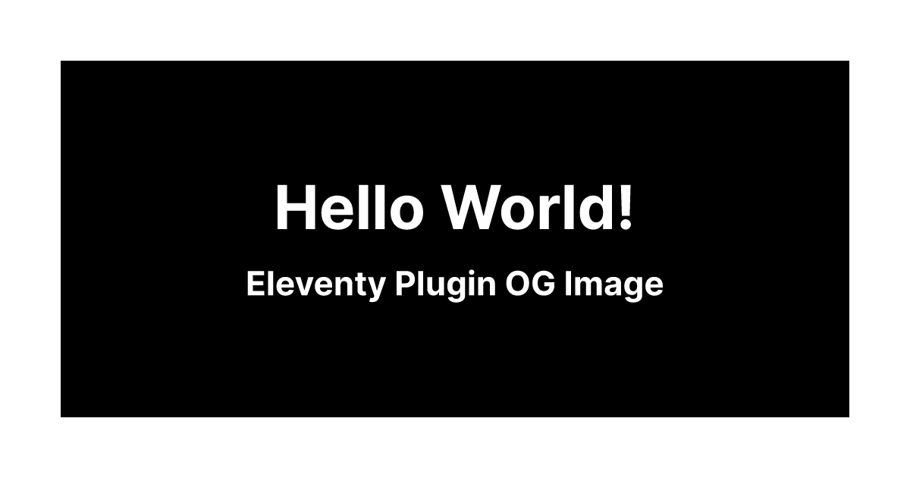

# Eleventy Plugin OG Image [](https://www.npmjs.com/package/eleventy-plugin-og-image)

This plugin helps to create Open Graph images in [Eleventy](https://www.11ty.dev/) using a template language of your choice[^1][^2] and CSS[^3] via [satori](https://github.com/vercel/satori). No headless browser will be harmed 😉.

## Usage

Install the package:

```shell
npm install eleventy-plugin-og-image --save-dev
```

Add the plugin to your `.eleventy.js`:

```js
const EleventyPluginOgImage = require('eleventy-plugin-og-image');

module.exports = (eleventyConfig) => {
  eleventyConfig.addPlugin(EleventyPluginOgImage, {
    satoriOptions: {
      fonts: [
        {
          name: 'Inter',
          data: fs.readFileSync('../path/to/font-file/inter.woff'),
          weight: 700,
          style: 'normal',
        },
      ],
    },
  });
};
```

Create an OG-image-template, using the supported HTML elements[^2] and CSS properties[^3]. CSS in `<style>` tags will be inlined, remote images fetched. This is an example `og-image.og.njk`:

```njk
<style>
    .root {
        width: 100%;
        height: 100%;
        display: flex;
        flex-direction: column;
        align-items: center;
        background: linear-gradient(135deg, #ef629f, #eecda3);
    }

    .title {
        color: white;
        font-size: 80px;
        margin: auto 0;
    }
</style>

<div class="root">
    <h1 class="title">{{ title }}</h1>
</div>
```

Call the `ogImage` shortcode inside the `<head>` in a template. The first argument is the filePath of the OG-image-template (required), second argument is for data (optional). Usage example in Nunjucks, e.g. `example-page.njk`:

```njk

```

### Result

Generated OG image `_site/og-images/s0m3h4sh.png`:



HTML output generated by the shortcode in `_site/example-page/index.html` (can be modified via the `generateHTML` option):

```html
<meta property="og:image" content="/og-images/s0m3h4sh.png" />
```

For applied usage see the [example](./example).

> **Note**
> The template language of the page and OG-image-template can be mixed and matched.[^1]

## Configuration

The following options can be passed when adding the plugin:

| Property              | Default                                                                    | Type                                                                                                       |                                                                                          |
| --------------------- | -------------------------------------------------------------------------- | ---------------------------------------------------------------------------------------------------------- | ---------------------------------------------------------------------------------------- |
| `inputFileGlob`       | `**/*.og.*`                                                                | `glob`                                                                                                     | This must match the OG-image-templates to prevent HTML compilation.                      |
| `outputFileExtension` | `png`                                                                      | [sharp output file formats](https://sharp.pixelplumbing.com/api-output#toformat)                           |                                                                                          |
| `outputDir`           | `_site/og-images/`                                                         | `string`                                                                                                   | Directory into which OG images will be emitted. Change `urlPath` accordingly.            |
| `urlPath`             | `/og-images/`                                                              | `string`                                                                                                   | URL-prefix which will be used in returned meta-tags. Change `outputDir` accordingly.     |
| `hashLength`          | `10`                                                                       | `number`                                                                                                   | Length of the hash used for filenames.                                                   |
| `generateHTML`        | `` (outputUrl) => `<meta property="og:image" content="${outputUrl}" />` `` | `function`                                                                                                 | Change the rendered HTML in pages.                                                       |
| `satoriOptions`       | `{ width: 1200, height: 630, fonts: [] }`                                  | [satori options](https://github.com/search?q=repo:vercel/satori+%22export+type+SatoriOptions%22&type=code) | If an OG-image-template contains text, it's required to load a font ([example](#usage)). |
| `sharpOptions`        | `undefined`                                                                | [sharp output options](https://sharp.pixelplumbing.com/api-output#toformat)                                | Options must be corresponding to choosen `outputFileExtension`.                          |

## Advanced Usage

### Custom Shortcode

If you would like to build your own shortcode, you can directly use the `renderOgImage` function.

```js
const { renderOgImage } = require('eleventy-plugin-og-image/render');

const { html, svg, pngBuffer } = await renderOgImage(inputPath, data, satoriOptions, templateConfig);
```

### Capture Output URL

If you don't want to directly generate HTML with the shortcode, you can modify the `generateHTML` option to directly return the `outputUrl`:

```js
eleventyConfig.addPlugin(EleventyPluginOgImage, {
  generateHTML: (outputUrl) => outputUrl,
});
```

Now you can capture the `outputUrl` in your page, e.g. in Nunjucks:

```njk

    

```

And use it anywhere below with `{{ ogOutputUrl }}`.

## Acknowledgements & Attributions

This plugin is deeply inspired by [@vercel/og](https://vercel.com/docs/concepts/functions/edge-functions/og-image-generation).

Furthermore, it would not be possible without:

- [satori](https://github.com/vercel/satori)
- [resvg](https://github.com/RazrFalcon/resvg/)/[resvg-js](https://github.com/yisibl/resvg-js)
- [sharp](https://github.com/lovell/sharp)

[^1]: Handlebars doesn't support async shortcodes and therefore can't use the `ogImage` shortcode. Nevertheless, an OG-image-template can use Handlebars (`.og.hbs`).
[^2]: Only a subset of HTML elements is [supported by satori](https://github.com/vercel/satori#html-elements).
[^3]: Only a subset of CSS properties are supported by [yoga-layout](https://github.com/facebook/yoga), which is [used by satori](https://github.com/vercel/satori#css).
